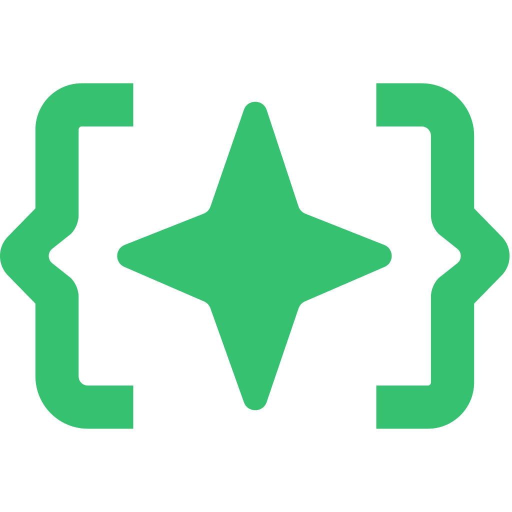
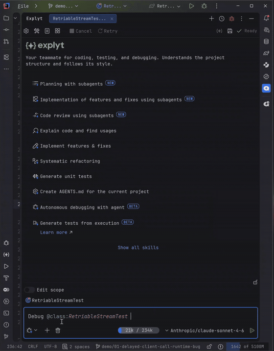
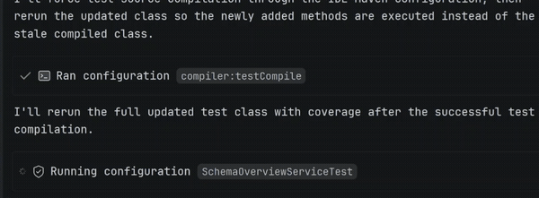
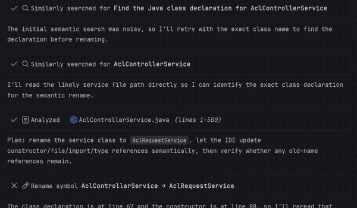
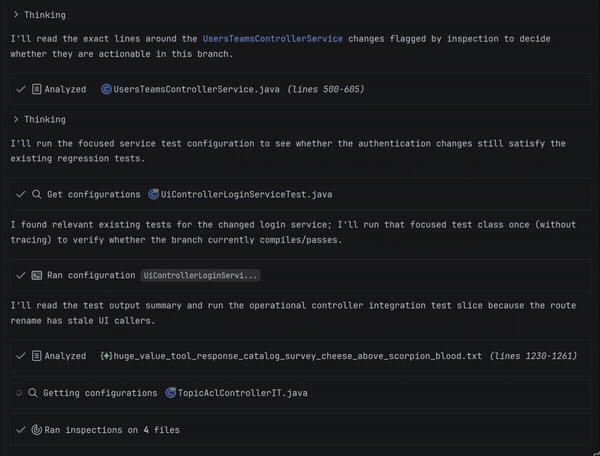

  

  
  
  

<h1 align="center">Explyt</h1>

Stop Paying Tokens for Context Your IDE Already Knows. Let AI Drive Your JetBrains Tools Directly.

  <a href="https://plugins.jetbrains.com/plugin/27979-explyt-ai-agent">Install from JetBrains Marketplace</a>
  ·
  <a href="https://explyt.ai/docs/category/explyt-test">Docs</a>
  ·
  <a href="https://explyt.ai/docs/explyt-test/feature-matrix">Feature matrix</a>
  ·
  <a href="https://github.com/explyt/explyt/issues/new/choose">Support</a>

---

Explyt is an AI agent for JetBrains IDEs that fixes code with the project facts your IDE already knows.

It can run configured tests and builds, increase test coverage with coverage feedback, find where symbols are used, inspect connected library source code, debug with variable values, call stacks and execution paths, apply IDE refactorings, and review code with IDE static analysis — in supported IDEs.

## IDE-native workflows

### Debug bugs with runtime facts

Instead of adding temporary logs, Explyt can run code under the debugger and inspect variable values, call stacks and execution paths before editing.

### Increase test coverage with IDE feedback

Instead of guessing which tests to write, Explyt runs tests with coverage, sees which lines are still uncovered, and keeps adding tests until coverage reaches your target — in supported IDEs.

### Change code safely with IDE refactorings

Instead of search-and-replace, Explyt applies IDE refactorings such as safe rename across the project, changing symbols — not matching text.

### Review code with IDE static analysis

Instead of only checking the AI's diff by eye, Explyt reviews code with built-in code analysis and highlights errors, warnings and potential issues before you accept the change — in supported IDEs.

## Built for JetBrains projects

Explyt is strongest where the IDE already holds critical project knowledge:

  
  
  
  
  
  
  

- **IntelliJ IDEA and Android Studio**  
  
  
  
  
  
    
  JUnit tests, Gradle/Maven builds, Spring Boot run setups, Spring profiles, classpaths, dependency versions, vulnerability search for Java/Kotlin, and test generation from real Spring executions.

- **PyCharm**  
  
  
  
    
  Python interpreters, virtual environments, test runs, package code, coverage feedback, flaky-test analysis and runtime debugging.

- **Rider**  
  
  
  
    
  .NET projects with configured run/debug setups, test runs, build-system support, connected dependency code and debugger-based investigation.

- **WebStorm**  
  
  
  
  
  
  
    
  npm, Jest, Vitest, Cypress and Playwright runs through the IDE, plus project-aware navigation, references, built-in code analysis and refactorings.

- **GoLand and PhpStorm**  
  
  
  
  
    
  Project-aware code navigation, references, built-in code analysis, refactorings and IDE-driven feedback for Go and PHP projects.

Some workflows depend on IDE and language support; see the [feature matrix](https://explyt.ai/docs/explyt-test/feature-matrix) for the current table.

## Installation

1. In your JetBrains IDE, open **Settings/Preferences → Plugins → Marketplace**, search for "Explyt AI Agent", or install directly from [JetBrains Marketplace](https://plugins.jetbrains.com/plugin/27979-explyt-ai-agent).
2. Open your project and choose model access based on your setup; where supported, use Explyt-hosted models or your own API key (BYOK).
3. Ask Explyt to fix a failing test, debug a runtime issue, increase test coverage, review pull request or safely refactor code.

## For teams

Explyt works through JetBrains IDE actions, so code changes, test runs, debugger sessions and refactorings stay visible in the IDE for review. Model access options depend on your setup; where supported, teams can use Explyt-hosted models or their own API key. For team or security evaluation, email support@explyt.com.

## Links

- [Documentation](https://explyt.ai/docs/category/explyt-test)
- [Feature matrix](https://explyt.ai/docs/explyt-test/feature-matrix)
- [JetBrains Marketplace](https://plugins.jetbrains.com/plugin/27979-explyt-ai-agent)
- [Other downloads](https://explyt.ai/download)

## Feedback and support

Report bugs, feature requests and quality issues through the [issue templates](https://github.com/explyt/explyt/issues/new/choose) or email support@explyt.com.

Explyt is a third-party plugin. It is not affiliated with, endorsed by, or sponsored by JetBrains.
